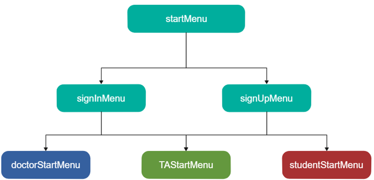
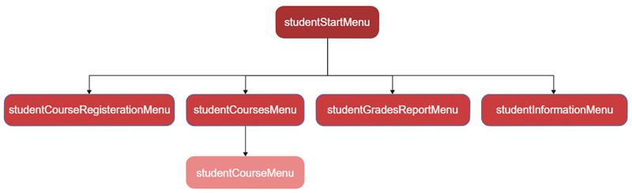
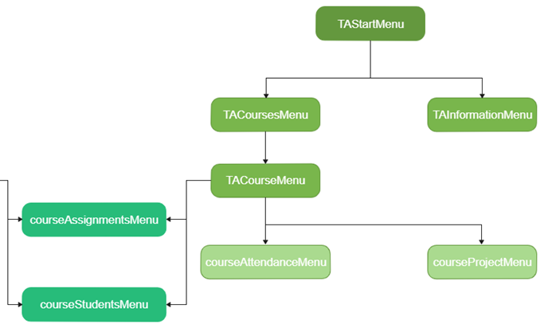
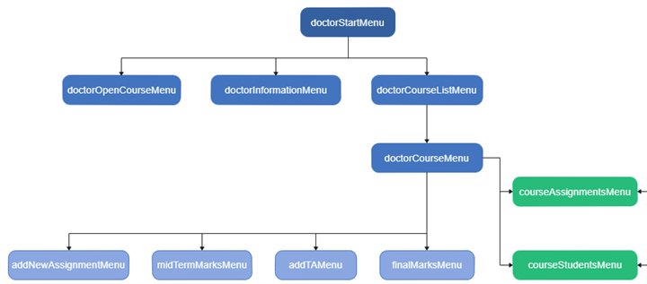
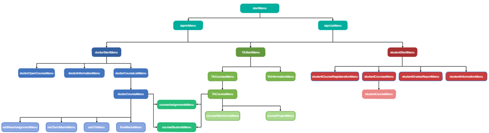

# Educational Management System
 EMS is a concole application that simulates the relation between Students, TAs and Doctors

## Content: 
- Demo Videos
- Project hirarchy
- Compilation


## Demo Videos


### Signing In/Up and Doctor Functionalities
https://user-images.githubusercontent.com/70268434/134228173-04639a3b-793f-4231-a514-ad7c88df8a2f.mp4

https://user-images.githubusercontent.com/70268434/134228512-83c5b430-e0d3-47d9-a545-e7d22ceb8f17.mp4

https://user-images.githubusercontent.com/70268434/134228849-cf8aed6f-8f02-4ae8-b1f8-fd0ffd47c7dd.mp4

### Student Functionalities
https://user-images.githubusercontent.com/70268434/134229100-28f27074-468d-41f7-9fa6-621f2d47365d.mp4

### TA Functionalities

https://user-images.githubusercontent.com/70268434/134229589-22b97829-ffc8-4163-af47-f6d29f497804.mp4


### Testing against Wrong anwers

https://user-images.githubusercontent.com/70268434/134229514-5a34dbcb-2f55-42e5-bab3-7cad8474f560.mp4


## Project Hierarchy 

 

&nbsp;&nbsp;&nbsp;
------------------------------------------------------------
&nbsp;&nbsp;&nbsp;



&nbsp;&nbsp;&nbsp;
------------------------------------------------------------
&nbsp;&nbsp;&nbsp;



&nbsp;&nbsp;&nbsp;
------------------------------------------------------------
&nbsp;&nbsp;&nbsp;
  


&nbsp;&nbsp;&nbsp;
------------------------------------------------------------
&nbsp;&nbsp;&nbsp;
  
 

&nbsp;&nbsp;&nbsp;
------------------------------------------------------------
&nbsp;&nbsp;&nbsp;

## Compilation

```sh
g++ -O2 main.cpp "headers/cpp/*" -o ems
```
